# things 1

In this case the network size is i:2 h:4 o:1


# 1
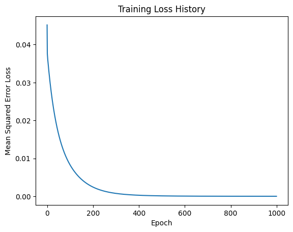
```
[<tf.Tensor: shape=(1, 2), dtype=float32, numpy=array([[1.0917614, 1.1021634]], dtype=float32)>, 
<tf.Tensor: shape=(1, 4), dtype=float32, numpy=array([[-0.64047146, -0.5501145 ,  0.16066985, -1.4510099 ]],
      dtype=float32)>]
```

# 2
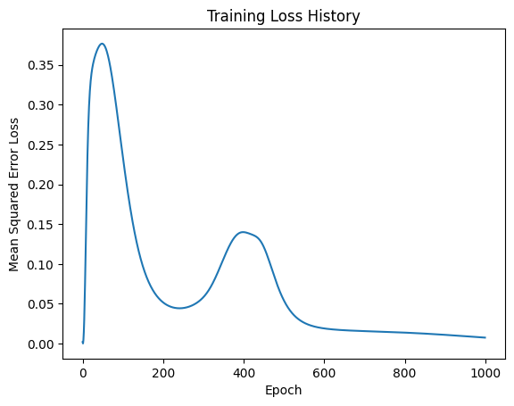
```
[<tf.Tensor: shape=(1, 2), dtype=float32, numpy=array([[-2.2784042,  1.6571004]], dtype=float32)>, 
<tf.Tensor: shape=(1, 4), dtype=float32, numpy=array([[0.27249697, 1.2842027 , 1.1063312 , 0.6129775 ]], dtype=float32)>]
```

# 3
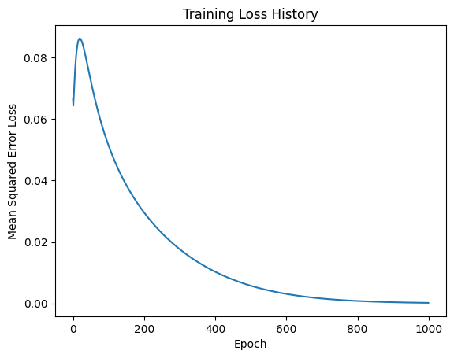
```
[<tf.Tensor: shape=(1, 2), dtype=float32, numpy=array([[-0.4860192, -0.720959 ]], dtype=float32)>, 
<tf.Tensor: shape=(1, 4), dtype=float32, numpy=array([[ 0.52608365, -0.24488366, -0.06926537, -0.36080393]],
      dtype=float32)>]
```

# 4
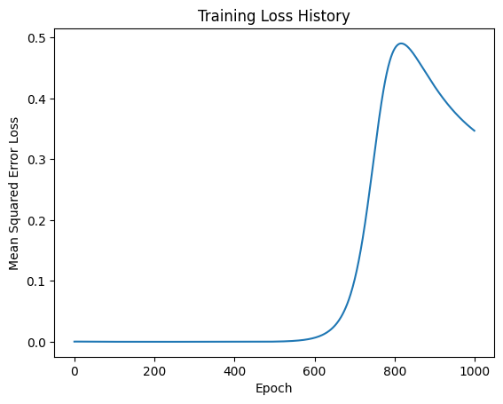
```
[<tf.Tensor: shape=(1, 2), dtype=float32, numpy=array([[-2.6009500e-04,  4.0385404e-01]], dtype=float32)>, <tf.Tensor: shape=(1, 4), dtype=float32, numpy=
array([[-0.5262701 , -1.3982708 , -0.35738194, -0.04879913]],
      dtype=float32)>]
Matrix     Frobenius Norm       Rank       Condition Number     Min Value       Max Value       Average         Sum            
0          0.403854             1          1.000000             -0.000260       0.403854        0.201797        0.403594       
1          1.536953             1          1.000000             -1.398271       -0.048799       -0.582680       -2.330722      

```

# 5
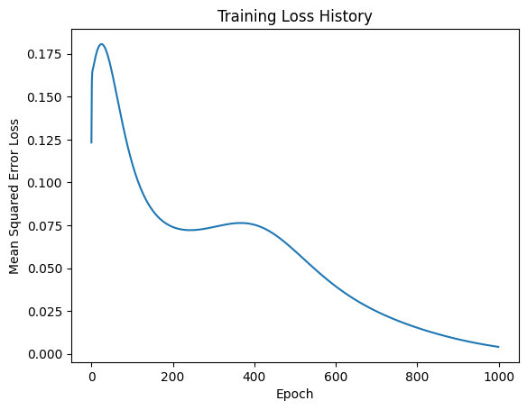
```
[<tf.Tensor: shape=(1, 2), dtype=float32, numpy=array([[ 1.0735515, -1.0823507]], dtype=float32)>, <tf.Tensor: shape=(1, 4), dtype=float32, numpy=array([[ 0.8824791, -1.8625376,  1.0448264,  0.2767944]], dtype=float32)>]
Matrix     Frobenius Norm       Rank       Condition Number     Min Value       Max Value       Average         Sum            
0          1.524466             1          1.000000             -1.082351       1.073552        -0.004400       -0.008799      
1          2.327250             1          1.000000             -1.862538       1.044826        0.085391        0.341562       
```

# 6
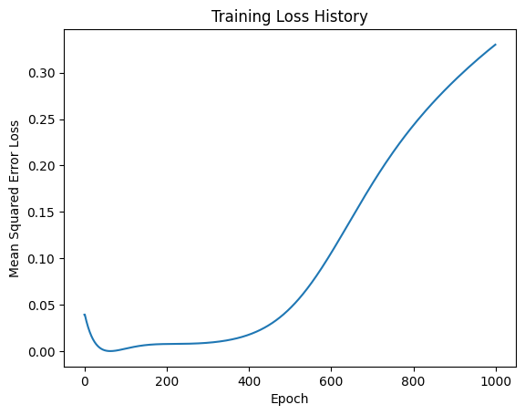
```
[<tf.Tensor: shape=(1, 2), dtype=float32, numpy=array([[ 0.43968156, -0.8932171 ]], dtype=float32)>, <tf.Tensor: shape=(1, 4), dtype=float32, numpy=array([[-1.2261393,  1.2252085, -0.9452137,  1.2030903]], dtype=float32)>]
Matrix     Frobenius Norm       Rank       Condition Number     Min Value       Max Value       Average         Sum            
0          0.995569             1          1.000000             -0.893217       0.439682        -0.226768       -0.453536      
1          2.312014             1          1.000000             -1.226139       1.225209        0.064236        0.256946       

```

# 7
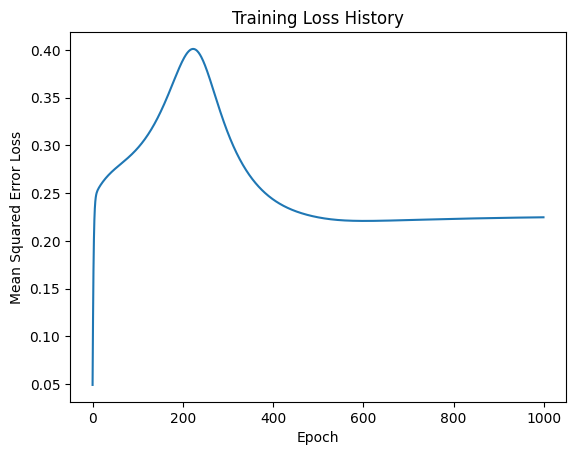
```
[<tf.Tensor: shape=(1, 2), dtype=float32, numpy=array([[ 0.78375316, -1.3285807 ]], dtype=float32)>, <tf.Tensor: shape=(1, 4), dtype=float32, numpy=array([[-0.5027714,  0.8191037,  0.7664259,  1.8120728]], dtype=float32)>]
Matrix     Frobenius Norm       Rank       Condition Number     Min Value       Max Value       Average         Sum            
0          1.542529             1          1.000000             -1.328581       0.783753        -0.272414       -0.544828      
1          2.189686             1          1.000000             -0.502771       1.812073        0.723708        2.894831       

```

# 8
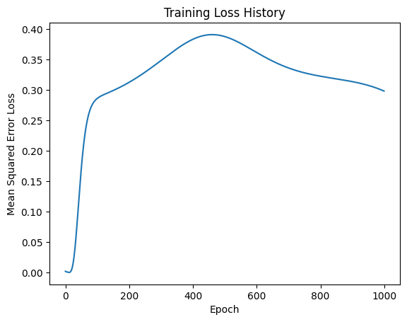
```
[<tf.Tensor: shape=(1, 2), dtype=float32, numpy=array([[ 0.15490709, -0.3141202 ]], dtype=float32)>, <tf.Tensor: shape=(1, 4), dtype=float32, numpy=
array([[ 0.22071613, -1.4066652 , -0.18151583,  0.86717   ]],
      dtype=float32)>]
Matrix     Frobenius Norm       Rank       Condition Number     Min Value       Max Value       Average         Sum            
0          0.350240             1          1.000000             -0.314120       0.154907        -0.079607       -0.159213      
1          1.677008             1          1.000000             -1.406665       0.867170        -0.125074       -0.500295      

```

# 9
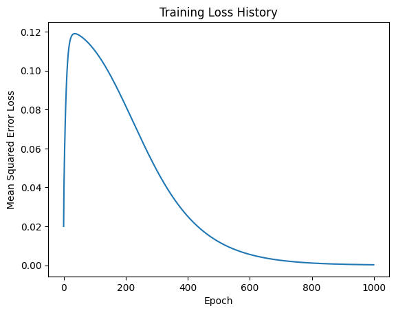
```
[<tf.Tensor: shape=(1, 2), dtype=float32, numpy=array([[-0.01176006,  0.6768697 ]], dtype=float32)>, <tf.Tensor: shape=(1, 4), dtype=float32, numpy=
array([[-0.31620166,  0.57956195, -0.7313221 ,  0.01549533]],
      dtype=float32)>]
Matrix     Frobenius Norm       Rank       Condition Number     Min Value       Max Value       Average         Sum            
0          0.676972             1          1.000000             -0.011760       0.676870        0.332555        0.665110       
1          0.985367             1          1.000000             -0.731322       0.579562        -0.113117       -0.452466      
```

# 10
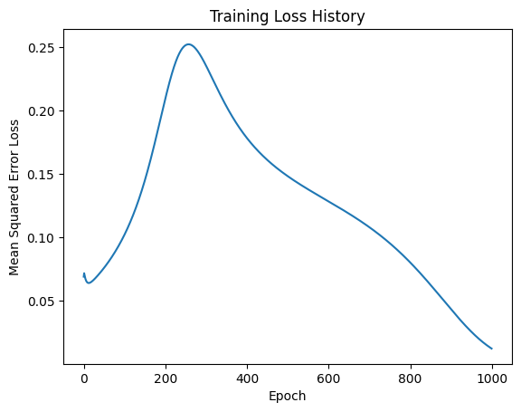
```
[<tf.Tensor: shape=(1, 2), dtype=float32, numpy=array([[-0.3174222 , -0.40170893]], dtype=float32)>, <tf.Tensor: shape=(1, 4), dtype=float32, numpy=
array([[ 0.5161833 , -0.6669382 , -0.26786947,  2.386369  ]],
      dtype=float32)>]
Matrix     Frobenius Norm       Rank       Condition Number     Min Value       Max Value       Average         Sum            
0          0.511983             1          1.000000             -0.401709       -0.317422       -0.359566       -0.719131      
1          2.545145             1          1.000000             -0.666938       2.386369        0.491936        1.967745       
```

# 11
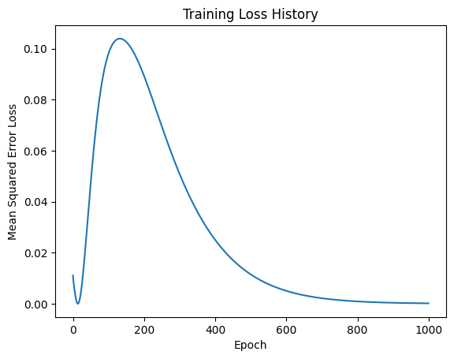
```
[<tf.Tensor: shape=(1, 2), dtype=float32, numpy=array([[-0.02346296, -1.0730066 ]], dtype=float32)>, <tf.Tensor: shape=(1, 4), dtype=float32, numpy=
array([[ 0.36636358, -0.15183477, -0.53338903,  2.0516284 ]],
      dtype=float32)>]
Matrix     Frobenius Norm       Rank       Condition Number     Min Value       Max Value       Average         Sum            
0          1.073263             1          1.000000             -1.073007       -0.023463       -0.548235       -1.096470      
1          2.156608             1          1.000000             -0.533389       2.051628        0.433192        1.732768       
```

# 12

```
[<tf.Tensor: shape=(1, 2), dtype=float32, numpy=array([[ 0.3418126, -1.5772084]], dtype=float32)>, <tf.Tensor: shape=(1, 4), dtype=float32, numpy=
array([[ 0.7231733 ,  0.05974749, -0.66698086,  0.40311608]],
      dtype=float32)>]
Matrix     Frobenius Norm       Rank       Condition Number     Min Value       Max Value       Average         Sum            
0          1.613822             1          1.000000             -1.577208       0.341813        -0.617698       -1.235396      
1          1.064855             1          1.000000             -0.666981       0.723173        0.129764        0.519056       
```

# 13
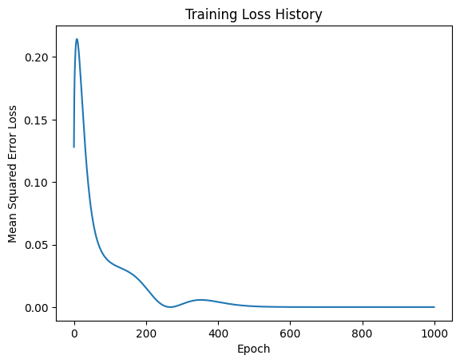
```
[<tf.Tensor: shape=(1, 2), dtype=float32, numpy=array([[ 0.316233 , -1.2044669]], dtype=float32)>, <tf.Tensor: shape=(1, 4), dtype=float32, numpy=
array([[ 1.4026659 ,  0.8854065 , -1.2941574 , -0.31955606]],
      dtype=float32)>]
Matrix     Frobenius Norm       Rank       Condition Number     Min Value       Max Value       Average         Sum            
0          1.245289             1          1.000000             -1.204467       0.316233        -0.444117       -0.888234      
1          2.127998             1          1.000000             -1.294157       1.402666        0.168590        0.674359       
```

